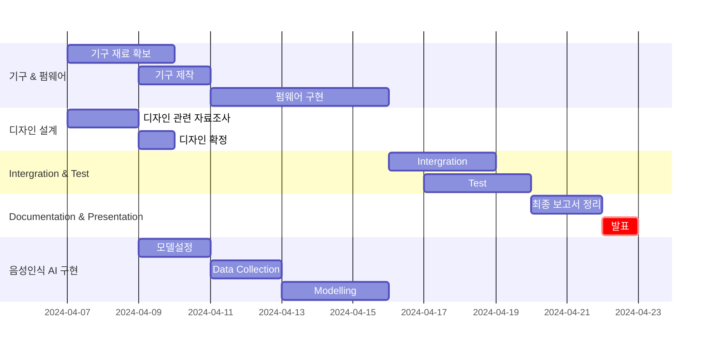

# Project Name: EcoSort 

>Sound recognition-based rubbish sorting system for recycling

EcoSort는 혁신적인 음성인식 기술을 활용하여 효율적인 자동 쓰레기 분류 시스템을 개발하는 프로젝트입니다. 이 시스템은 쓰레기를 던져서 쓰레기통 윗부분에 부딪혀 만드는 소리를 인식하여 해당 쓰레기가 플라스틱, 철, 종이 중 어느 것인지 식별하고 분류하는 기능을 제공합니다.

이 프로젝트는 환경 보호를 위한 혁신적인 기술의 결합을 통해 쓰레기 처리의 효율성과 편의성을 증대시킵니다. 쓰레기 분류는 많은 사람들이 소홀히 하는 문제 중 하나입니다. 따라서 EcoSort는 이러한 문제를 해결하고자 음성인식 기술을 활용하여 쓰레기를 자동으로 분류함으로써 환경 보호 의식을 높이고 쓰레기 처리 과정을 최적화하는 것을 목표로 합니다.

## 프로젝트 요약
* Members
  | Name | Role |
  |----|----|
  | 김승환 | Project lead, 프로젝트를 총괄하고 마일스톤을 생성하고 프로젝트 이슈 진행상황을 관리한다. |
  | 송인태 | Embedded system , 기구및 제어 시스템을 제작하고, 펌웨어를 코딩한다. |
  | 김용철 | AI modeling, 재활용 소재에 대한 음성 인식 AI를 모델링 한다. |
  | 김준영 | Assistant, 전반적인 도움 및 문서작업 보조 |
* [프로젝트 깃허브 주소](https://github.com/CodeMystero/soundRecognitionRecycleBin)
* 발표자료 : https://github.com/goodsense/project_aewsome/doc/slide.ppt

## 프로젝트 마일스톤 - Gantt Chart




## High Level Design


## Clone code

* (각 팀에서 프로젝트를 위해 생성한 repository에 대한 code clone 방법에 대해서 기술)

```shell
git clone https://github.com/xxx/yyy/zzz
```

## Prerequite

* (프로잭트를 실행하기 위해 필요한 dependencies 및 configuration들이 있다면, 설치 및 설정 방법에 대해 기술)

```shell
python -m venv .venv
source .venv/bin/activate
pip install -r requirements.txt
```

## Steps to build

* (프로젝트를 실행을 위해 빌드 절차 기술)

```shell
cd ~/xxxx
source .venv/bin/activate

make
make install
```

## Steps to run

* (프로젝트 실행방법에 대해서 기술, 특별한 사용방법이 있다면 같이 기술)

```shell
cd ~/xxxx
source .venv/bin/activate

cd /path/to/repo/xxx/
python demo.py -i xxx -m yyy -d zzz
```

## Output


## Appendix

* (참고 자료 및 알아두어야할 사항들 기술)
